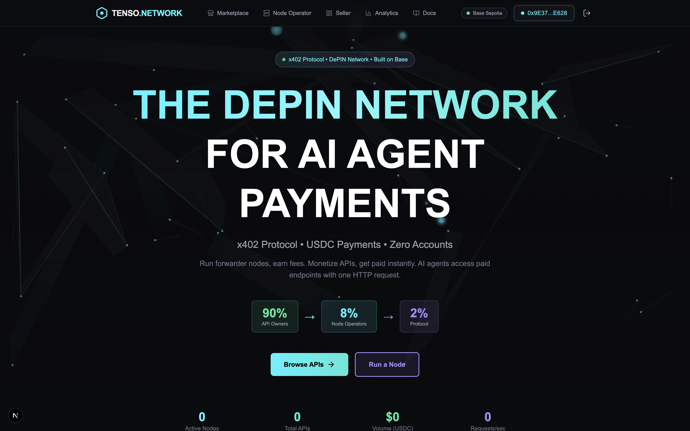
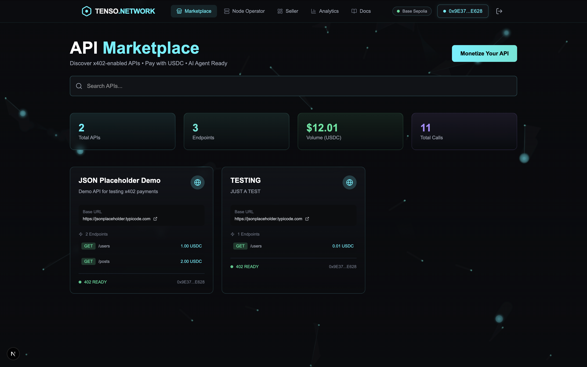
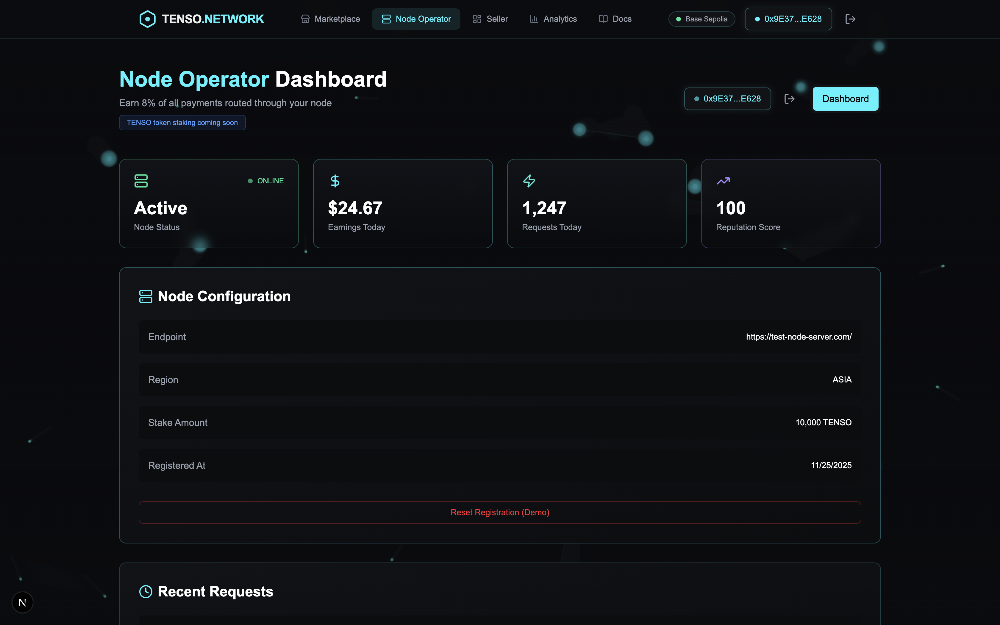
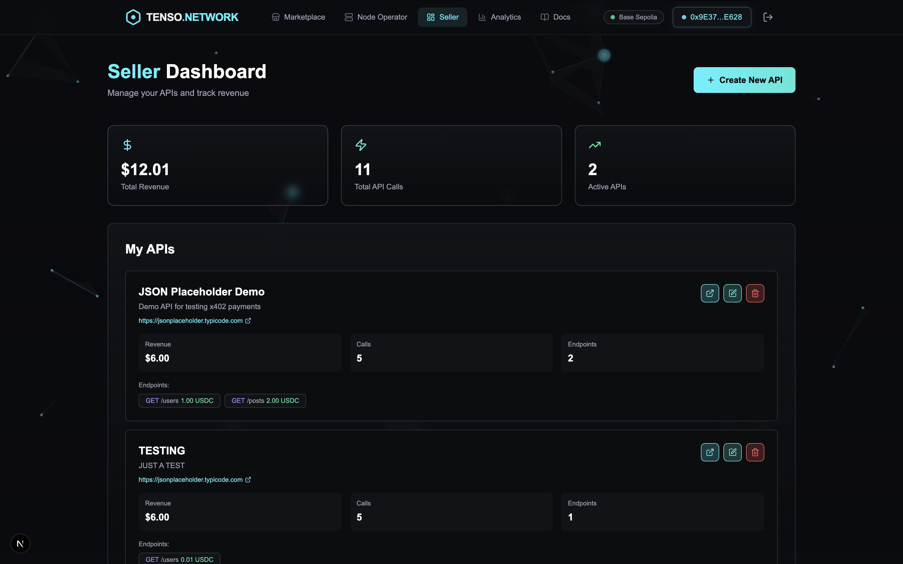
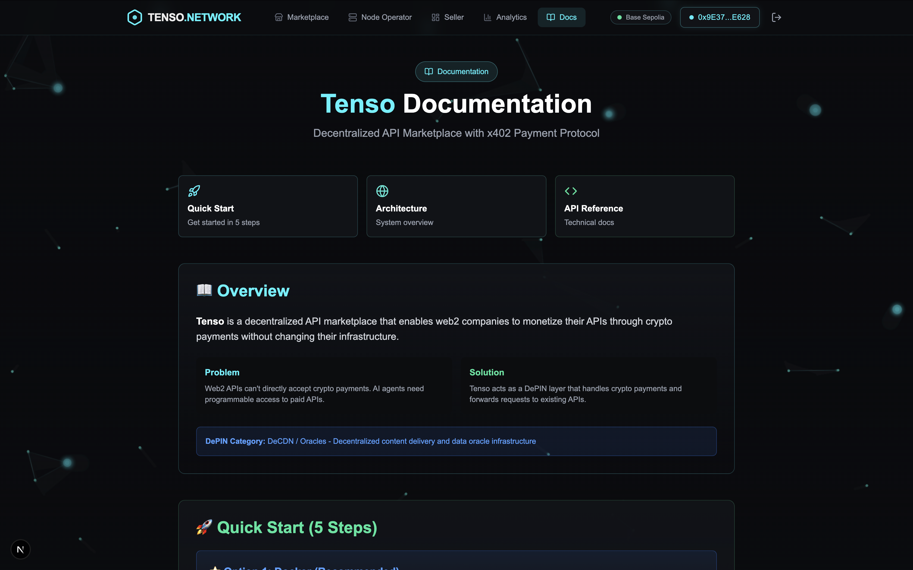

# Tenso - Decentralized API Marketplace

<div align="center">


**Bridging Web2 APIs to AI Agents through DePIN**

[](https://opensource.org/licenses/MIT)
[](https://sepolia.basescan.org/)
[](https://pingo.io)

</div>

## 💡 The Problem
- **Web2 APIs** cannot accept crypto payments natively.
- **AI Agents** cannot use credit cards or pass KYC checks.
- **Existing Solutions** are centralized and charge high fees (30%+).

## 🚀 The Solution: Tenso
Tenso is a **DePIN (Decentralized Physical Infrastructure Network)** of payment gateway nodes that enables autonomous AI agents to pay for Web2 API access using crypto, without API providers needing to change a single line of code.

We implement the **x402 Payment Protocol** (HTTP 402 Payment Required) over a decentralized network:
1.  **Gasless Payments**: Agents sign EIP-712 messages to authorize payments (no gas fees).
2.  **DePIN Nodes**: Independent operators run "Forwarder Nodes" that verify payments and route requests.
3.  **Fair Revenue Split**: Smart contracts enforce a **90/8/2 split** on-chain.

---

## 🏗️ Architecture

```
┌─────────────┐       ┌──────────────┐       ┌─────────────┐
│  AI Agent   │◄─────►│   Tenso Web  │◄─────►│  MetaMask   │
│ / End User  │       │   Frontend   │       │   Wallet    │
└─────────────┘       └──────────────┘       └─────────────┘
                              │
                              │ x402 Request
                              ▼
                       ┌──────────────┐
                       │   Forwarder  │ (DePIN Node)
                       │   (Hono.js)  │
                       └──────────────┘
                              │
                    ┌─────────┴─────────┐
                    │                   │
                    ▼                   ▼
            ┌──────────────┐    ┌──────────────┐
            │ Smart        │    │  Upstream    │
            │ Contracts    │    │     API      │
            │ (Base)       │    │  (Web2)      │
            └──────────────┘    └──────────────┘
                 │
                 ├─ PaymentRouter (90/8/2 split)
                 ├─ PaymentVerifier (x402)
                 └─ NodeRegistry (DePIN)
```

### DePIN Network Topology
```
┌─────────────────────────────────────────────────┐
│          Forwarder Node Network                 │
│                                                 │
│  ┌──────────┐  ┌──────────┐  ┌──────────┐     │
│  │  Node 1  │  │  Node 2  │  │  Node 3  │     │
│  │ US-East  │  │ EU-West  │  │  Asia    │     │
│  │ Earns 8% │  │ Earns 8% │  │ Earns 8% │     │
│  └──────────┘  └──────────┘  └──────────┘     │
│                                                 │
│  Anyone can run a node • Stake TENSO tokens     │
│  Geographic distribution • Earn USDC fees       │
└─────────────────────────────────────────────────┘
```

## ⚙️ How It Works

### For AI Agents (Buyers)
1. **Discover API** on Tenso marketplace
2. **Call endpoint** without payment → Receive `402 Payment Required`
3. **Sign USDC payment** (gasless via EIP-712)
4. **Retry with `X-PAYMENT` header** → Get data!

**Example Integration (Python):**
```python
import requests
# 1. Call API (Expect 402)
response = requests.get("https://node1.tenso.network/api/weather")

# 2. Sign Payment (EIP-712)
signature = sign_usdc_permit(amount=1.0, payTo=response.json()["payTo"])

# 3. Retry with Payment
data = requests.get(
    "https://node1.tenso.network/api/weather",
    headers={"X-PAYMENT": signature}
)
```

### For API Providers (Sellers)
1. **Register Endpoint**: Set price in USDC (e.g., $0.01/call)
2. **Receive Payments**: 90% of fees go directly to your wallet
3. **No Code Changes**: Your API stays exactly the same. Tenso handles the paywall.

### For Node Operators (DePIN)
1. **Stake TENSO**: 10,000 tokens (Testnet: Free)
2. **Run Forwarder**: Simple Docker container
3. **Earn 8%**: Process payments and route requests
4. **Reputation**: Higher uptime = more traffic

---

## 💰 Tokenomics & Revenue Split

Tenso enforces a strict **90/8/2** revenue split on-chain for every transaction.

| Party | Share | Role |
|-------|-------|------|
| **API Provider** | **90%** | Creates value (Data/Service) |
| **Node Operator** | **8%** | Provides infrastructure (DePIN) |
| **Protocol** | **2%** | Treasury & Development |

**Example:**
For a **$1.00** API call:
- **$0.90** → API Owner
- **$0.08** → Node Operator
- **$0.02** → Protocol Treasury

*All payments are settled instantly in USDC.*

## 🛠️ Tech Stack

- **Frontend**: Next.js 14 (App Router), Wagmi v2, Viem, TailwindCSS
- **Backend/Forwarder**: Hono.js, Viem, TypeScript
- **Database**: JSON files (MVP), Future: PostgreSQL
- **DePIN**: Decentralized forwarder nodes, Edge compute
- **Blockchain**: Solidity, Base Sepolia, USDC (ERC20)
- **Smart Contracts**: PaymentRouter, PaymentVerifier, NodeRegistry

## 📜 Smart Contracts (Base Sepolia)

| Contract | Address | Description |
|----------|---------|-------------|
| PaymentRouter | `0x6fa35e1f6ab4291432b36f16578614e90750b7e6` | Handles 90/8/2 payment splits |
| PaymentVerifier | `0xa73d7c7703b23cc4692fdd817345ad29db5ac4e9` | Verifies EIP-712 signatures |
| NodeRegistry | `0x5b2222610e04380e1caf3988d88fbd15686a1b6c` | DePIN node management |
| USDC (Test) | `0x036CbD53842c5426634e7929541eC2318f3dCF7e` | Test USDC token |

[View on BaseScan →](https://sepolia.basescan.org/)

## 🎯 Key Features

### For API Sellers (Web2 Companies)
✅ **Zero Code Changes**: No need to modify existing APIs  
✅ **Instant Monetization**: Deploy and start receiving payments in 2 minutes  
✅ **Crypto Native**: Receive USDC directly to your wallet  
✅ **Revenue Dashboard**: Track earnings and API calls in real-time  
✅ **90% Revenue Share**: Sellers get 90% of every payment  

### For Buyers (AI Agents / Developers)
✅ **Gasless Payments**: Pay with signature, no gas fees  
✅ **x402 Protocol**: Standard HTTP 402 Payment Required  
✅ **Instant Access**: Pay → Call API in 1 flow  
✅ **On-chain Proof**: All payments recorded on blockchain  
✅ **Fair Pricing**: Pay-per-call, no subscription  

### For Node Operators (DePIN)
✅ **8% Revenue Share**: Earn from every routed transaction  
✅ **Simple Setup**: Run forwarder node with Docker  
✅ **Reputation System**: Better uptime = more traffic  
✅ **Decentralized**: No single point of failure  

## � Project Structure

```
tenso-depin/
├── contracts/                 # Solidity smart contracts
│   ├── src/
│   │   ├── PaymentRouter.sol
│   │   ├── PaymentVerifier.sol
│   │   └── NodeRegistry.sol
│   └── test/
├── forwarder/                 # DePIN forwarder node
│   ├── src/
│   │   └── index.ts          # Hono server + payment logic
│   ├── data/
│   │   ├── apis.json         # API metadata
│   │   └── analytics.json    # Real-time analytics
│   ├── Dockerfile
│   └── .env.example
├── web/                       # Next.js frontend
│   ├── app/
│   │   ├── marketplace/      # Browse & call APIs
│   │   ├── seller/           # Seller dashboard
│   │   ├── node-operator/    # Node operator dashboard
│   │   └── docs/             # Documentation
│   ├── components/
│   ├── Dockerfile
│   └── package.json
├── docker-compose.yml         # One-command setup
└── README.md
```

## 🔑 Environment Variables

**Single `.env` file at project root** - No nested configuration!

```bash
# Quick setup
cp .env.example .env
nano .env
```

### Required Variables
```bash
# Wallet Configuration
PRIVATE_KEY=your_private_key_here
NODE_OPERATOR_ADDRESS=0xYourAddress

# Network
RPC_URL=https://sepolia.base.org

# Contract Addresses (Base Sepolia)
PAYMENT_ROUTER_ADDRESS=0x6fa35e1f6ab4291432b36f16578614e90750b7e6
PAYMENT_VERIFIER_ADDRESS=0xa73d7c7703b23cc4692fdd817345ad29db5ac4e9
NODE_REGISTRY_ADDRESS=0x5b2222610e04380e1caf3988d88fbd15686a1b6c
USDC_ADDRESS=0x036CbD53842c5426634e7929541eC2318f3dCF7e
```


## 🧪 Testing

### Prerequisites
- MetaMask wallet
- Base Sepolia testnet ETH ([Faucet](https://www.coinbase.com/faucets/base-ethereum-sepolia-faucet))
- Base Sepolia test USDC (mint from contract)

### Test Flow
1. **Connect Wallet**: Click "Connect Wallet" and select Base Sepolia
2. **Get Test USDC**: Mint from USDC contract on BaseScan
3. **Browse APIs**: Go to `/marketplace`
4. **Call API**: Select endpoint → Sign payment → See transaction hash
5. **Verify Payment**: Click TX hash to see 90/8/2 split on BaseScan
6. **Check Analytics**: Real volume and call counts update

## 🏆 Hackathon Submission (PinGo DePIN 2025)

### Track
DePIN Build Track - **DeCDN / Oracles**

### ✅ Key Achievements
- **x402 Forwarder**: Fully functional single-node implementation
- **Gasless Payments**: EIP-712 signature verification
- **Smart Contracts**: Deployed `NodeRegistry`, `PaymentRouter`, `PaymentVerifier`
- **Fair Revenue**: 90/8/2 split verified on-chain
- **Dashboards**: Seller analytics, Node Operator staking, Marketplace stats
- **DevOps**: One-command Docker deployment

### 🗺️ Roadmap

#### Phase 2 (Post-Hackathon)
- [ ] TENSO token for node staking
- [ ] Multi-chain support (Ethereum, Polygon)
- [ ] AI agent SDK (Python, JavaScript)
- [ ] API rate limiting & authentication
- [ ] Decentralized storage (IPFS/Arweave)

#### Phase 3 (Production)
- [ ] Mainnet deployment
- [ ] Enterprise API onboarding
- [ ] Advanced analytics dashboard
- [ ] SLA guarantees with reputation system
- [ ] Mobile app

## 📸 Gallery

| Landing Page | Marketplace |
|:---:|:---:|
|  |  |
| **Seller Dashboard** | **Node Operator Dashboard** |
|  |  |
| **Analytics** | **Documentation** |
|  |  |

## 🤝 Contributing

We welcome contributions from the community! Whether it's fixing bugs, improving documentation, or suggesting new features, your help is appreciated.

Please read our [CONTRIBUTING.md](CONTRIBUTING.md) for details on our code of conduct, and the process for submitting pull requests.

---

## ❓ Troubleshooting

### Common Issues

**1. Docker Port Conflict**
> `Error: Bind for 0.0.0.0:3000 failed: port is already allocated`
- **Fix**: Stop other services running on port 3000 or modify `docker-compose.yml` to map to a different port (e.g., `3001:3000`).

**2. MetaMask Nonce Error**
> `Nonce too low` or transaction stuck
- **Fix**: Reset your MetaMask account activity for Base Sepolia (Settings > Advanced > Clear Activity Tab Data).

**3. API Payment Failed**
> `402 Payment Required` persists after signing
- **Fix**: Ensure you have enough Sepolia USDC. Use the faucet if needed.

---

## 🙏 Acknowledgements

- **[Base](https://base.org)** - For the fast, low-cost L2 infrastructure
- **[Coinbase Developer Platform](https://www.coinbase.com/developer-platform)** - For RPC and Paymaster tools
- **[x402 Protocol](https://x402.org)** - For the open standard for internet-native payments
- **[Wagmi](https://wagmi.sh) & [Viem](https://viem.sh)** - For best-in-class Ethereum hooks
- **[Hono](https://hono.dev)** - For the ultra-fast edge web framework
- **[PinGo](https://pingo.io)** - For hosting the DePIN Hackathon

## 📄 License

MIT License - see [LICENSE](LICENSE)

## 🔗 Links

- **Live Demo**: https://tenso.network
- **Documentation**: https://tenso.network/docs
- **GitHub Repo**: https://github.com/azharpratama/tenso
- **Base Sepolia Explorer**: https://sepolia.basescan.org/

---

<div align="center">

**Built for PinGo Indonesian DePIN Hackathon 2025** 🚀

[GitHub](https://github.com/azharpratama/tenso) • [Demo](https://tenso.network) • [Docs](https://tenso.network/docs)

</div>
